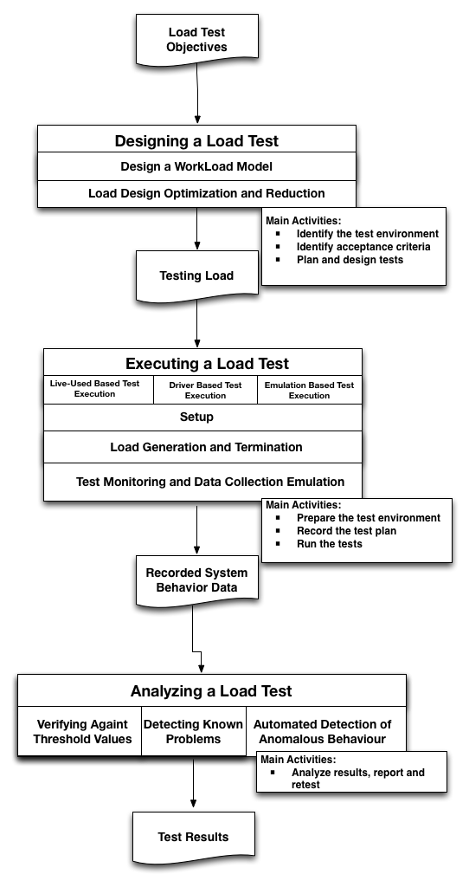

---
output: html_document
bibliography: capstone.bib
---

# Machine Learning Engineer Nanodegree
## Improving Stress Search Based Testing using Reinforcement Learning
Francisco Nauber Bernardo Gois 
December 31st, 2050

##Introduction
Many systems must support concurrent access by hundreds or thousands of users. Failure to providing scalable access to users may results in catastrophic failures and unfavorable media coverage [@Jiang2010]. The explosive growth of the Internet has contributed to the increased need for applications that perform at an appropriate speed. Performance problems are often detected late in the application life cycle, and the later they are discovered, the greater the cost to fix them [@Molyneaux2009].

The use of stress testing is an increasingly common practice owing to the increasing number of users. In this scenario, the inadequate treatment of a workload generated by concurrent or simultaneous access due to several users can result in highly critical failures and negatively affect the customers perception of the company [@Draheim2006b] [@Jiang2010].  Stress testing determines the responsiveness, throughput, reliability, or scalability of a system under a given workload. The quality of the results of applying a given load testing to a system is closely linked to the implementation of the workload strategy. The performance of many applications depends on the load applied under different conditions. In some cases, performance degradation and failures arise only in stress conditions [@Garousi2010] [@Jiang2010].

A stress test uses a set of workloads that consist of many types of usage scenarios and a combination of different numbers of users. A load is typically based on an operational profile. Different parts of an application should be tested under various parameters and stress conditions [@Babbar2011]. The correct application of a stress test should cover most parts of an application above the expected load conditions [@Draheim2006b].

A stress test usually lasts for several hours or even a few days and only tests a limited number of workloads. The major challenge is to find the workloads that expose a major number of errors and to discover the maximum number of users supported by an application under testing [@Barna2011]. 

Search-based testing is seen as a promising approach to verifying timing constraints [@Afzal2009a]. A common objective of a load search-based test is to find  scenarios that produce execution times that violate the specified timing constraints [@Sullivan]. 

This capstone project has two main goals:
*To ascertain whether reinforcement learning are superior to single metaheuristics when solving stress testing problem.
*To improve the process of stress testing with a tool and a test model that evolves during its execution.

This paper proposes the use of reinforcement learning in stress tests. A tool named IAdapter (www.iadapter.org, github.com/naubergois/newiadapter), a JMeter plugin for performing search-based load tests, extended [@Gois2016]. Two experiments were conducted to validate the proposed approach.

The remainder of the paper is organized as follows. Section 2 presents a brief introduction about load, performance, and stress tests. Section 3 presents concepts about the workload model. Section 4 presents concepts about search based tests. Section 5 presents concepts about metaheuristic algorithms.Section 6 presents concepts about hybrid metaheuristic algorithms. Section 7 discusses the related work. Section 8 presents the research-proposed approach. Section 9 presents the IAdapter tool. Section 10 shows the results of two experiments performed using the IAdapter plugin.  Conclusions and further work are presented in Section 11.

###Load, Performance and Stress Testing

Load, performance, and stress testing are typically done to locate bottlenecks in a system, to support a performance-tuning effort, and to collect other performance-related indicators to help stakeholders get informed about the quality of the application being tested [@Sandler2004][@Corporation2007]. 

The performance testing aims at verifying a specified system performance. This kind of test is executed by simulating hundreds of simultaneous users or more over a defined time interval [@DiLucca2006]. The purpose of this assessment is to demonstrate that the system reaches its performance objectives [@Sandler2004]. 

In a load testing, the system is evaluated at predefined load levels [@DiLucca2006]. The aim of this test is to determine whether the system can reach its performance targets for availability, concurrency, throughput, and response time. Load testing is the closest to real application use [@Molyneaux2009].

The stress testing verifies the system behavior against heavy workloads [@Sandler2004], which are executed to evaluate a system beyond its limits, validate system response in activity peaks, and verify whether the system is able to recover from these conditions. It differs from other kinds of testing in that the system is executed on or beyond its breakpoints, forcing the application or the supporting infrastructure to fail [@DiLucca2006] [@Molyneaux2009].

The next subsections present details about the stress test process, automated stress test tools and the stress test results.

####Stress Test Process

Contrary to functional testing, which has clear testing objectives, Stress testing objectives are not clear in the early development stages and are often defined later on a case-by-case basis. The Fig. [1](#image) shows a commom Load, Performance and Stress test process  [@Jiang2010].

The goal of the load design phase is to devise a load, which can uncover non-functional problems. Once the load is defined, the system under test executes the load and the system behavior under load is recorded. Load testing practitioners then analyze the system behavior to detect problems [@Jiang2010]. 

Once a proper load is designed, a load test is executed. The load test execution phase consists of the following three main aspects: (1) Setup, which includes system deployment and test execution setup; (2) Load Generation and Termination, which consists of generating the load; and (3) Test Monitoring and Data Collection, which includes recording the system behavior during execution [@Jiang2010]. 

The core activities in conducting an usual Load, Performance and Stress tests are  [@Erinle2013]: 

* Identify the test environment: identify test and production environments and knowing the hardware, software, and network configurations helps derive an effective test plan and identify testing challenges from the outset.

* Identify acceptance criteria: identify the response time, throughput, and resource utilization goals and constraints.

* Plan and design tests:identify the test scenarios.In the context of testing, a scenario is a sequence of steps in an application. It can represent a use case or a business function such as searching a product catalog, adding an item to a shopping cart, or placing an order [@Corporation2007].

* Prepare the test environment: configure the test environment, tools, and resources necessary to conduct the planned test scenarios.

* Record the test plan: record the planned test scenarios using a testing tool.

* Run the tests: Once recorded, execute the test plans under light load and verify the correctness of the test scripts and output results.

* Analyze results, report, and retest: examine the results of each successive run and identify areas of bottleneck that need addressing.  

####Automated Stress Test Tools

Automated tools are needed to carry out serious load, stress, and performance testing. Sometimes, there is simply no practical way to provide reliable, repeatable performance tests without using some form of automation. The aim of any automated test tool is to simplify the testing process. Automated Test Tool  typically have the following components [@Molyneaux2009]:

*Scripting module: Enable recording of end-user activities in different middleware protocols;

*Test management module: Allows the creation of test scenarios;

*Load injectors: Generate the load with multiple workstations or servers;

*Analysis module: Provides the ability to analyse the data collected by each test interation.

Apache JMeter is a free open source stress testing tool.  It has a large user base and offers lots of plugins to aid testing. JMeter is a desktop application designed to test and measure the performance and functional behavior of applications. The application it's purely Java-based and is highly extensible through a provided API (Application Programming Interface). JMeter works by acting as the client of a client/server application. JMeter allows multiple concurrent users to be simulated on the application [@Halili2008][@Erinle2013]. 

JMeter has components organized  in a hierarchical manner. The Test Plan is the main component in a JMeter script. A typical test plan will consist of one or more Thread Groups, logic controllers, listeners, timers, assertions, and configuration elements:

*Thread Group: Test management module responsible to simulate the users used in a test. All elements of a test plan must be under a thread group.

*Listeners: Analysis module responsible to provide access to the information gathered by JMeter about the test cases .

*Samplers: Load injectors module responsible to send requests to a server, while Logical Controllers let you customize its logic.

*Timers: allow JMeter to delay between each request.

*Assertions: test if the application under test it is returning the correct results.

*Configuration Elements: configure detais about the request protocol and test elements.

####Stress Test Results

The system behavior recorded during the test execution phase needs to be analyzed to determine if there are any load-related functional or non-functional problems [@Jiang2010].

There can be many formats of system behavior like resource usage data or end-to-end response time, which is recorded as response time for each individual request. These types of data need to be processed before comparing against threshold values.A proper data summarization technique is needed to describe these many data instances into one number. Some researchers advocate that the 90-percentile response time is a better measurement than the average/medium response time, as the former accounts for most of the peaks, while eliminating the outliers [@Jiang2010].

###WorkLoad Model

Load, performance, or stress testing projects should start with the development of a model for user workload that an application receives. This should take into consideration various performance aspects of the application and the infrastructure that a given workload will impact. A workload is a key component of such a model [@Molyneaux2009].

The term workload represents the size of the demand that will be imposed on the application under test in an execution. The metric  used for measure a workload is dependent on the application domain, such as the length of the video in a transcoding application for multimedia files or the size of the input files in a file compression application [@Feitelson2013] [@Molyneaux2009] [@Goncalves2014]. 

Workload is also defined by the load distribution between the identified transactions at a given time. Workload helps researchers study the system behavior identified in several load models. A workload model can be designed to verify the predictability, repeatability, and scalability of a system \cite{Feitelson2013} \cite{Molyneaux2009}.

Workload modeling is the attempt to create a simple and generic model that can then be used to generate synthetic workloads. The goal is typically to be able to create workloads that can be used in performance evaluation studies. Sometimes, the synthetic workload is supposed to be similar to those that occur in practice in real systems \cite{Feitelson2013} \cite{Molyneaux2009}.

There are two kinds of workload models: descriptive and generative. The main difference between the two is that descriptive models just try to mimic the phenomena observed in the workload, whereas generative models try to emulate the process that generated the workload in the first place \cite{DiLucca2006}. 

In descriptive models, one finds different levels of abstraction on the one hand and different levels of fidelity to the original data on the other hand. The most strictly faithful models try to mimic the data directly using the statistical distribution of the data. The most common strategy used in descriptive modeling is to create a statistical model of an observed workload (Fig. \ref{fig:descriptivemodel}). This model is applied to all the workload attributes, e.g., computation, memory usage, I/O behavior, communication, etc. \cite{DiLucca2006}. Fig. \ref{fig:descriptivemodel} shows a simplified workflow of a descriptive model. The workflow has six phases. In the first phase, the user uses the system in the production environment. In the second phase, the tester collects the user's data, such as logs, clicks, and preferences, from the system. The third phase consists in developing a model designed to emulate the user's behavior. The fourth phase is made up of the execution of the test, emulation of the user's behavior, and log gathering.

\begin{figure}[!ht]
\centering
\includegraphics[width=0.4\textwidth]{./images/workloadmodel1300dpi.png}
\caption{Workload modeling based on statistical data \cite{DiLucca2006}}
\label{fig:descriptivemodel}
\end{figure}

Generative models are indirect in the sense that they do not model the statistical distributions. Instead, they describe how users will behave when they generate the workload. An important benefit of the generative approach is that it facilitates manipulations of the workload. It is often desirable to be able to change the workload conditions as part of the evaluation. Descriptive models do not offer any option regarding how to do so. With the generative models, however, we can modify the workload-generation process to fit the desired conditions \cite{DiLucca2006}. The difference between the workflows of the descriptive and the generative models is that user behavior is not collected from logs, but simulated from a model that can receive feedback from the test execution (Fig. \ref{fig:generativemodel}).

\begin{figure}[!ht]
\centering
\includegraphics[width=0.4\textwidth]{./images/workloadmodel2300dpi.png}
\caption{Workload modeling based on the generative model \cite{DiLucca2006}}
\label{fig:generativemodel}
\end{figure}

Both load model have their advantages and disadvantages. In general, loads resulting from realistic-load based design techniques (Descriptive models) can be used to detect both functional and non-functional problems. However, the test durations are usually longer and the test analysis is more difficult. Loads resulting from fault-inducing load design techniques (Generative models) take less time to uncover potential functional and non-functional problems, the resulting loads usually only cover a small portion of the testing objectives \cite{Jiang2010}. The presented research work uses a generative model.

## Proposal
_(approx. 2-3 pages)_

### Domain Background
_(approx. 1-2 paragraphs)_

In this section, provide brief details on the background information of the domain from which the project is proposed. Historical information relevant to the project should be included. It should be clear how or why a problem in the domain can or should be solved. Related academic research should be appropriately cited in this section, including why that research is relevant. Additionally, a discussion of your personal motivation for investigating a particular problem in the domain is encouraged but not required.

### Problem Statement
_(approx. 1 paragraph)_

In this section, clearly describe the problem that is to be solved. The problem described should be well defined and should have at least one relevant potential solution. Additionally, describe the problem thoroughly such that it is clear that the problem is quantifiable (the problem can be expressed in mathematical or logical terms) , measurable (the problem can be measured by some metric and clearly observed), and replicable (the problem can be reproduced and occurs more than once).

### Datasets and Inputs
_(approx. 2-3 paragraphs)_

In this section, the dataset(s) and/or input(s) being considered for the project should be thoroughly described, such as how they relate to the problem and why they should be used. Information such as how the dataset or input is (was) obtained, and the characteristics of the dataset or input, should be included with relevant references and citations as necessary It should be clear how the dataset(s) or input(s) will be used in the project and whether their use is appropriate given the context of the problem.

### Solution Statement
_(approx. 1 paragraph)_

In this section, clearly describe a solution to the problem. The solution should be applicable to the project domain and appropriate for the dataset(s) or input(s) given. Additionally, describe the solution thoroughly such that it is clear that the solution is quantifiable (the solution can be expressed in mathematical or logical terms) , measurable (the solution can be measured by some metric and clearly observed), and replicable (the solution can be reproduced and occurs more than once).

### Benchmark Model
_(approximately 1-2 paragraphs)_

In this section, provide the details for a benchmark model or result that relates to the domain, problem statement, and intended solution. Ideally, the benchmark model or result contextualizes existing methods or known information in the domain and problem given, which could then be objectively compared to the solution. Describe how the benchmark model or result is measurable (can be measured by some metric and clearly observed) with thorough detail.

### Evaluation Metrics
_(approx. 1-2 paragraphs)_

In this section, propose at least one evaluation metric that can be used to quantify the performance of both the benchmark model and the solution model. The evaluation metric(s) you propose should be appropriate given the context of the data, the problem statement, and the intended solution. Describe how the evaluation metric(s) are derived and provide an example of their mathematical representations (if applicable). Complex evaluation metrics should be clearly defined and quantifiable (can be expressed in mathematical or logical terms).

### Project Design
_(approx. 1 page)_

In this final section, summarize a theoretical workflow for approaching a solution given the problem. Provide thorough discussion for what strategies you may consider employing, what analysis of the data might be required before being used, or which algorithms will be considered for your implementation. The workflow and discussion that you provide should align with the qualities of the previous sections. Additionally, you are encouraged to include small visualizations, pseudocode, or diagrams to aid in describing the project design, but it is not required. The discussion should clearly outline your intended workflow of the capstone project.

-----------

**Before submitting your proposal, ask yourself. . .**

- Does the proposal you have written follow a well-organized structure similar to that of the project template?
- Is each section (particularly **Solution Statement** and **Project Design**) written in a clear, concise and specific fashion? Are there any ambiguous terms or phrases that need clarification?
- Would the intended audience of your project be able to understand your proposal?
- Have you properly proofread your proposal to assure there are minimal grammatical and spelling mistakes?
- Are all the resources used for this project correctly cited and referenced?
