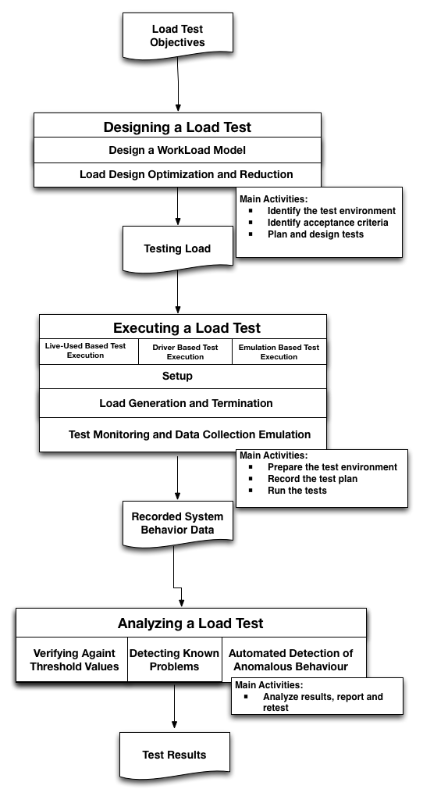
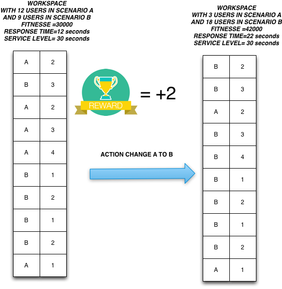

---
output: html_document
bibliography: capstone.bib
---

# Machine Learning Engineer Nanodegree
## Improving Stress Search Based Testing using Reinforcement Learning
Francisco Nauber Bernardo Gois 
November 25st, 2016

##Introduction
Many systems must support concurrent access by hundreds or thousands of users. Failure to providing scalable access to users may results in catastrophic failures and unfavorable media coverage [@Jiang2010]. The explosive growth of the Internet has contributed to the increased need for applications that perform at an appropriate speed. Performance problems are often detected late in the application life cycle, and the later they are discovered, the greater the cost to fix them [@Molyneaux2009].

The use of stress testing is an increasingly common practice owing to the increasing number of users. In this scenario, the inadequate treatment of a workload generated by concurrent or simultaneous access due to several users can result in highly critical failures and negatively affect the customers perception of the company [@Draheim2006b] [@Jiang2010].  Stress testing determines the responsiveness, throughput, reliability, or scalability of a system under a given workload. The quality of the results of applying a given load testing to a system is closely linked to the implementation of the workload strategy. The performance of many applications depends on the load applied under different conditions. In some cases, performance degradation and failures arise only in stress conditions [@Garousi2010] [@Jiang2010].

A stress test uses a set of workloads that consist of many types of usage scenarios and a combination of different numbers of users. A load is typically based on an operational profile. Different parts of an application should be tested under various parameters and stress conditions [@Babbar2011]. The correct application of a stress test should cover most parts of an application above the expected load conditions [@Draheim2006b].

A stress test usually lasts for several hours or even a few days and only tests a limited number of workloads. The major challenge is to find the workloads that expose a major number of errors and to discover the maximum number of users supported by an application under testing [@Barna2011]. 

Search-based testing is seen as a promising approach to verifying timing constraints [@Afzal2009a]. A common objective of a load search-based test is to find  scenarios that produce execution times that violate the specified timing constraints [@Sullivan]. 

This capstone project has two main goals:
*To ascertain whether reinforcement learning are superior to single metaheuristics when solving stress testing problem.
*To improve the process of stress testing with a tool and a test model that evolves during its execution.

This capstone project proposes the use of reinforcement learning in stress tests. A tool named IAdapter (www.iadapter.org, github.com/naubergois/newiadapter), a JMeter plugin for performing search-based load tests, extended [@Gois2016]. Two experiments were conducted to validate the proposed approach.

The remainder of the paper is organized as follows. Section 2 presents a brief introduction about load, performance, and stress tests. Section 3 presents concepts about the workload model. Section 4 presents concepts about search based tests. Section 5 presents concepts about metaheuristic algorithms.Section 6 presents concepts about hybrid metaheuristic algorithms. Section 7 discusses the related work. Section 8 presents the research-proposed approach. Section 9 presents the IAdapter tool. Section 10 shows the results of two experiments performed using the IAdapter plugin.  Conclusions and further work are presented in Section 11.

###Load, Performance and Stress Testing

Load, performance, and stress testing are typically done to locate bottlenecks in a system, to support a performance-tuning effort, and to collect other performance-related indicators to help stakeholders get informed about the quality of the application being tested [@Sandler2004][@Corporation2007]. 

The performance testing aims at verifying a specified system performance. This kind of test is executed by simulating hundreds of simultaneous users or more over a defined time interval [@DiLucca2006]. The purpose of this assessment is to demonstrate that the system reaches its performance objectives [@Sandler2004]. 

In a load testing, the system is evaluated at predefined load levels [@DiLucca2006]. The aim of this test is to determine whether the system can reach its performance targets for availability, concurrency, throughput, and response time. Load testing is the closest to real application use [@Molyneaux2009].

The stress testing verifies the system behavior against heavy workloads [@Sandler2004], which are executed to evaluate a system beyond its limits, validate system response in activity peaks, and verify whether the system is able to recover from these conditions. It differs from other kinds of testing in that the system is executed on or beyond its breakpoints, forcing the application or the supporting infrastructure to fail [@DiLucca2006] [@Molyneaux2009].

The next subsections present details about the stress test process, automated stress test tools and the stress test results.

####Stress Test Process

Contrary to functional testing, which has clear testing objectives, Stress testing objectives are not clear in the early development stages and are often defined later on a case-by-case basis. The Fig. [1](#image) shows a commom Load, Performance and Stress test process  [@Jiang2010].

The goal of the load design phase is to devise a load, which can uncover non-functional problems. Once the load is defined, the system under test executes the load and the system behavior under load is recorded. Load testing practitioners then analyze the system behavior to detect problems [@Jiang2010]. 

Once a proper load is designed, a load test is executed. The load test execution phase consists of the following three main aspects: (1) Setup, which includes system deployment and test execution setup; (2) Load Generation and Termination, which consists of generating the load; and (3) Test Monitoring and Data Collection, which includes recording the system behavior during execution [@Jiang2010]. 

The core activities in conducting an usual Load, Performance and Stress tests are  [@Erinle2013]: 

* Identify the test environment: identify test and production environments and knowing the hardware, software, and network configurations helps derive an effective test plan and identify testing challenges from the outset.

* Identify acceptance criteria: identify the response time, throughput, and resource utilization goals and constraints.

* Plan and design tests:identify the test scenarios.In the context of testing, a scenario is a sequence of steps in an application. It can represent a use case or a business function such as searching a product catalog, adding an item to a shopping cart, or placing an order [@Corporation2007].

* Prepare the test environment: configure the test environment, tools, and resources necessary to conduct the planned test scenarios.

* Record the test plan: record the planned test scenarios using a testing tool.

* Run the tests: Once recorded, execute the test plans under light load and verify the correctness of the test scripts and output results.

* Analyze results, report, and retest: examine the results of each successive run and identify areas of bottleneck that need addressing.  

####Automated Stress Test Tools

Automated tools are needed to carry out serious load, stress, and performance testing. Sometimes, there is simply no practical way to provide reliable, repeatable performance tests without using some form of automation. The aim of any automated test tool is to simplify the testing process. Automated Test Tool  typically have the following components [@Molyneaux2009]:

*Scripting module: Enable recording of end-user activities in different middleware protocols;

*Test management module: Allows the creation of test scenarios;

*Load injectors: Generate the load with multiple workstations or servers;

*Analysis module: Provides the ability to analyse the data collected by each test interation.

Apache JMeter is a free open source stress testing tool.  It has a large user base and offers lots of plugins to aid testing. JMeter is a desktop application designed to test and measure the performance and functional behavior of applications. The application it's purely Java-based and is highly extensible through a provided API (Application Programming Interface). JMeter works by acting as the client of a client/server application. JMeter allows multiple concurrent users to be simulated on the application [@Halili2008][@Erinle2013]. 

JMeter has components organized  in a hierarchical manner. The Test Plan is the main component in a JMeter script. A typical test plan will consist of one or more Thread Groups, logic controllers, listeners, timers, assertions, and configuration elements:

*Thread Group: Test management module responsible to simulate the users used in a test. All elements of a test plan must be under a thread group.

*Listeners: Analysis module responsible to provide access to the information gathered by JMeter about the test cases .

*Samplers: Load injectors module responsible to send requests to a server, while Logical Controllers let you customize its logic.

*Timers: allow JMeter to delay between each request.

*Assertions: test if the application under test it is returning the correct results.

*Configuration Elements: configure detais about the request protocol and test elements.

####Stress Test Results

The system behavior recorded during the test execution phase needs to be analyzed to determine if there are any load-related functional or non-functional problems [@Jiang2010].

There can be many formats of system behavior like resource usage data or end-to-end response time, which is recorded as response time for each individual request. These types of data need to be processed before comparing against threshold values.A proper data summarization technique is needed to describe these many data instances into one number. Some researchers advocate that the 90-percentile response time is a better measurement than the average/medium response time, as the former accounts for most of the peaks, while eliminating the outliers [@Jiang2010].

###WorkLoad Model

Load, performance, or stress testing projects should start with the development of a model for user workload that an application receives. This should take into consideration various performance aspects of the application and the infrastructure that a given workload will impact. A workload is a key component of such a model [@Molyneaux2009].

The term workload represents the size of the demand that will be imposed on the application under test in an execution. The metric  used for measure a workload is dependent on the application domain, such as the length of the video in a transcoding application for multimedia files or the size of the input files in a file compression application [@Feitelson2013] [@Molyneaux2009] [@Goncalves2014]. 

Workload is also defined by the load distribution between the identified transactions at a given time. Workload helps researchers study the system behavior identified in several load models. A workload model can be designed to verify the predictability, repeatability, and scalability of a system [@Feitelson2013] [@Molyneaux2009].

Workload modeling is the attempt to create a simple and generic model that can then be used to generate synthetic workloads. The goal is typically to be able to create workloads that can be used in performance evaluation studies. Sometimes, the synthetic workload is supposed to be similar to those that occur in practice in real systems [@Feitelson2013][@Molyneaux2009].

There are two kinds of workload models: descriptive and generative. The main difference between the two is that descriptive models just try to mimic the phenomena observed in the workload, whereas generative models try to emulate the process that generated the workload in the first place [@DiLucca2006]. 

In descriptive models, one finds different levels of abstraction on the one hand and different levels of fidelity to the original data on the other hand. The most strictly faithful models try to mimic the data directly using the statistical distribution of the data. The most common strategy used in descriptive modeling is to create a statistical model of an observed workload (Fig. 2). This model is applied to all the workload attributes, e.g., computation, memory usage, I/O behavior, communication, etc. [@DiLucca2006]. Fig. 3 shows a simplified workflow of a descriptive model. The workflow has six phases. In the first phase, the user uses the system in the production environment. In the second phase, the tester collects the user's data, such as logs, clicks, and preferences, from the system. The third phase consists in developing a model designed to emulate the user's behavior. The fourth phase is made up of the execution of the test, emulation of the user's behavior, and log gathering.

Generative models are indirect in the sense that they do not model the statistical distributions. Instead, they describe how users will behave when they generate the workload. An important benefit of the generative approach is that it facilitates manipulations of the workload. It is often desirable to be able to change the workload conditions as part of the evaluation. Descriptive models do not offer any option regarding how to do so. With the generative models, however, we can modify the workload-generation process to fit the desired conditions [@DiLucca2006]. The difference between the workflows of the descriptive and the generative models is that user behavior is not collected from logs, but simulated from a model that can receive feedback from the test execution (Fig. 3).

Both load model have their advantages and disadvantages. In general, loads resulting from realistic-load based design techniques (Descriptive models) can be used to detect both functional and non-functional problems. However, the test durations are usually longer and the test analysis is more difficult. Loads resulting from fault-inducing load design techniques (Generative models) take less time to uncover potential functional and non-functional problems, the resulting loads usually only cover a small portion of the testing objectives [@Jiang2010]. The presented research work uses a generative model.

## Reinforcement Learning

Reinforcement learning (RL) is an active area of machine learning that is also receiveing attention from the fields of decision theory, operations research and control engineering. Reinforcement learning is the problem faced by an agent that must learn behavior through trial and error interactions with a dynamic environment [@Kaelbling1996]. In the standard reinforcement learning model  an agent is connected to its environment via perception and action. On each step of interaction the agent receives as input, i,  some indication of the current state,  s, of the environment;  the agent then chooses an action,a,to generate as output [@Mahadevan2003].

Most of RL research is based on the formalism of Markov Decision Process (MDP). A finite MDP models the following type of problem. At each stage in a sequence of stages, an agent observes a system's state s, contained in a finite set, and execute an action a selected from the finite, non-empty set of admissible actions. The agent receives an immediate reward having expected value R(s,a), and the state transition probabilities, together comprise what RL researchers often call one-step model of action a [@Mahadevan2003].

An MDP is a five tuple: (S,A,R,T,$\gamma$), where:

+ S is a set of states.

+ A is a set of actions.

+ R(s,a):S x A $\rightarrow$  ${I\!R}$ is a reward function.  

+ T (s, a, $s^{'}$ ) = Pr($s^{'}$ | s, a) is a probability distribution, denoting the probability of transitioning from state s $\in$ S to state $s^{'}$ $\in$ S when the agent executes action a $\in$ A.

The agents objective as maximizing the expected sum of discounted rewards. One variation is the infinite-horizon objective, in which the agent must maximize its discounted long term reward arbitrarily into the future [@Abel2016]:

$$ max \sum_{t=0}^{\infty}\gamma^{t}R(s_t,a_t)   $$

Notably, the discount factor $\gamma^{t}$ decreases to 0 as $t \rightarrow \infty$, so the agent is biased toward maximizing reward closer to the present. Alternatively, one could consider the finite-horizon case, in which the agent must maximize its reward up to a certain point in the future, say k time steps away:

$$ max \sum_{t=0}^{k}R(s_t,a_t)   $$

Solutions come in the form of a policy, which specifies how the agent ought to act in any given state, $\pi : S  \rightarrow  A$. Policies may also be probabilistic, and map to a probability distribution on the action set. The optimal policy is one that maximizes the expected long term discounted reward from every state:

$$ arg max_{\pi} E [ \sum_{t}\gamma^{t}R(s_t,a_t)|\pi ]  $$

## Proposal

The purpose of these capstone project it is use reinforcement learning in stress tests to find the worsts scenarios presented by the application until the response time is minor than a service level pre established. This is a non-deterministic problem where there is no guarantee that the optimal solution will be found.

### Domain Background

The search for the worst behavior presented by an application is a field of search based tests. Search Based Software Testing (SBST) is the sub-area of Search Based Software Engineering concerned with software testing. Search-based software testing is the application of metaheuristic search techniques to generate software tests. SBSE uses computational search techniques to tackle software engineering problems, typified by large complex search spaces. SBSE derives test inputs for a software system with the goal of improving various criteria. The test adequacy criterion is transformed into a fitness function and a set of solutions in the search space are evaluated with respect to the fitness function using a metaheuristic search technique [@Afzal2009a] [@Aleti2016] [@Harman2015].

The next Fig. shows the growth in papers published on SBST and SBSE. The data is taken from the SBSE repository (http://crestweb.cs.ucl.ac.uk/resources/sbse_repository/). 
The aim of the SBSE repository is to contain every SBSE paper. Although no repository can guarantee 100% precision and recall, the SBSE repository has proved sufficiently usable that it has formed the basis of several other detailed analyses of the literature [@Harman2015].

SBST has made many achievements, and demonstrated its wide applicability and increasing uptake. Nevertheless, there are pressing open problems and challenges that need more attention like to extend SBST to test non-functional properties, a topic that remains relatively under-explored, compared to structural testing. The next Fig. shows the non-funtional SBST by year [@Aleti2016][@Harman2015]. 

There are many kinds of non-functional search based tests [@Afzal2009a]:

* Execution time: The application of evolutionary algorithms to find the best and worst case execution times (BCET, WCET).

* Quality of service: uses metaheuristic search techniques to search violations of service level agreements (SLAs).

* Security: apply a variety of metaheuristic search techniques  to detect security vulnerabilities like detecting buffer overflows.

* Usability: concerned with construction of covering array which is a combinatorial object.

* Safety: Safety testing is an important component of the testing strategy of safety critical systems where the systems are required to meet safety constraints.

A variety of metaheuristic search techniques are found to be applicable for non-functional testing including simulated annealing, tabu search, genetic algorithms, ant colony methods, grammatical evolution, genetic programming and swarm intelligence methods. The next figure shows a comparison between the range of metaheuristcs and the type of non-functional search based test.The Data comes from Afzal et al. [@Afzal2009]. Afzal's work adds to some of the latest research in this area ( [@Garousi2006] [@Garousi2010] [@DiAlesio2013] [@DiAlesio2014] [@Alesio2015] [@Gois2016]). 

### Problem Statement

The main problem to be resolved it is:

+find the maximum number of users that support a application until the service level response time

+ find the scenarios that presents some error

### Benchmark 

Next table shows a comparison between the research studies on load, performance, and stress tests presented by Afzal et al. [@Afzal2009]. Afzal's work adds to some of the latest research in this area ([@Garousi2006] [@Garousi2010] [@DiAlesio2013] [@DiAlesio2014] [@Alesio2015] [@Gois2016] ). 

The columns represent the type of tool used (prototype or functional tool), and the rows represent the metaheuristic approach used by each research study (genetic algorithm, Tabu search, simulated annealing, or a customized algorithm). The table also sorts the research studies by the type of fitness function used (execution time or processor cycles). 

Wegener et al. [@Wegener1997] used genetic algorithms(GA) to search for input situations that produce very long or very short execution times. The fitness function used was the execution time of an individual measured in micro seconds [@Wegener1997]. 

Alander et al. [@Alander] performed experiments in a simulator environment to measure response time extremes of protection relay software using genetic algorithms. The fitness function used was the response time of the tested software. The results showed that GA generated more input cases with longer response times [@Alander]. 

Wegener and Grochtmann performed a  experimentation
to compare GA with random testing. The fitness function used was duration of execution measured in processor cycles.  The results showed that, with a large number of input parameters, GA obtained more extreme execution times with less or equal testing effort than random testing [@J.WegenerK.GrimmM.GrochtmannH.Sthamer1996] [@Wegener1998] .

Gro et. al. [@Gross2000] presented a prediction model  which can be used to predict evolutionary testability. The research confirmed that there is a relationship between the complexity of a test object and the ability of a search algorithm to produce input parameters according to B/WCET [@Gross2000]. 

Tracey et al. [@Tracey1998] used simulated annealing (SA) to test four
simple programs. The results of the research presented that the use of SA was more effective with larger parameter space. The authors highlighted the need of a detailed comparison of various optimization techniques to explore WCET and BCET of the of the system under test [@Tracey1998].

Pohlheim and Wegener used an extension of genetic algorithms with multiple sub-populations, each using a different search strategy. The duration of execution measured in processor cycles was taken as the fitness
function. The GA found longer execution times for all the given modules in comparison with systematic testing[@Pohlheim2005].

Briand et al. [@Briand2005] used GA to find the sequence of arrival times of events for aperiodic tasks, which will cause the greatest delays in the execution of the target task. A prototype tool named real-time test tool (RTTT) was developed to facilitate the execution of runs of genetic algorithm. Two case studies were conducted and results illustrated that RTTT was a useful tool to stress a system under test [@Briand2005].

Di Penta et al. [@Penta2007] used GA to create test data that violated QoS constraints causing SLA violations. The generated test data included combinations of inputs. The approach was applied to two case studies. The first case study was an audio processing workflow. The second case study, a service producing charts, applied the black-box approach with fitness calculated only on the basis of how close solutions violate QoS constraint. In case of audio workflow, the GA outperformed random search. For the second case study, use of black-box approach successfully violated the response time constraint, showing the violation of QoS constraints for a real service available on the Internet [@Penta2007].

Garousi presented a stress test methodology aimed at increasing chances of discovering faults related to distributed traffic in distributed systems. The technique uses as input a specified UML 2.0 model of a system, augmented with timing information.The results indicate that the technique is significantly more effective at detecting distributed traffic-related faults when compared to standard test cases based on an operational profile [@Garousi2006].

Alesio describe stress test case generation as a search problem over the space of task arrival times. The research search for worst case scenarios maximizing deadline misses where each scenario characterizes a test case. The paper combine two strategies, GA and Constraint Programming (CP). The results show that, in comparison with GA and CP in isolation, GA+CP achieves nearly the same effectiveness as CP and the same efficiency and solution diversity as GA, thus combining the advantages of the two strategies. Alesio concludes that a combined GA+CP approach to stress testing is more likely to scale to large and complex systems [@Alesio2015].

Gois et al. proposes an hybrid metaheuristic approach using genetic algorithms, simulated annealing, and tabu search algorithms to perform stress testing. A tool named IAdapter, a JMeter plugin used for performing search-based stress tests, was developed. Two experiments were performed to validate the solution. In the first experiment, the signed-rank Wilcoxon non- parametrical procedure was used for comparing the results. The significant level adopted was 0.05. The procedure showed that there was a significant improvement in the results with the Hybrid Metaheuristic approach.
In the second experiment, the whole process of stress and performance tests, which took 3 days and about 1800 executions, was carried out without the need for monitoring by a test designer. The tool automatically selected the next scenarios to be run up to the limit of six generations previously established [@Gois2016]. 

### Evaluation Metrics

The metric chosen by the solution it's the average fitnesse value of the individuals that represent the worst case response time presented by the application. The fitnesse value is measure by a objective function defined in the next section.

### Project Design

The proposed solution is to extends the IAdapter tool [@Gois2016]  to perform a search based test using Reinforcement Learning. In IAdapter, all tests are represented in  a workspace model.

The IAdapter representation is composed by a linear vector with 23 positions. The first position represents the name of an individual. The second position represents the algorithm (genetic algorithm, simulated annealing, or Tabu search) used by the individual. The third position represents the type of test (load, stress, or performance). The next positions represent 10 scenarios and their numbers of users. Each scenario is an atomic operation: the scenario must log into the application, run the task goal, and undo any changes performed, returning the application to its original state [@Gois2016].

The next figure presents the solution representation and an example using the crossover operation. In the example, genotype 1 has the Login scenario with 2 users, the Form scenario with 0 users, and the Search scenario with 3 users. Genotype 2 has the Delete scenario with 10 users, the Search scenario with 0 users, and the Include scenario with 5 users. After the crossover operation, we obtain a genotype with the Login scenario with 2 users, the Search scenario with 0 users, and the Include scenario with 5 users [@Gois2016].

The state model will be composed by four variables:

* Increase fitnesse value: variable thas assumes the values true or false. True if the fitnesse value was increased. False if the fitnesse value was decrease.

* Minor than the service level: variable thas assumes the values true or false. True if the response time is minor than the service level and  False if the response time is major than service level.

* Error: variable thas assumes the values true or false. True if the state has an error and False if the state hasn't a error.

* Action:  variable where the number of values it is correlated with the number of test scenarios. If the test has tree scenarios, the possible actions are { change scenario 1 to scenario 2, change scenario 2 to scenario 3, change scenario 3 to scenario 1}

* Equals to service level: : variable thas assumes the values true or false. True if the response time is equals to the service level and  False if the response time is different of service level value.

The value of reward will be :

* -0.4 if Increase fitnesse value is True , Minor than service level it is true and Error is false

* -2: if Increase fitnesse value is false 

* 2: if Error is true

* 2: Equals to service level is true

* -2: if Minor than service level is false

####Objective Function

The proposed solution was designed to be used with independent testing teams in various situations where the teams have no direct access to the environment where the application under test was installed. Therefore, the IAdapter plugin uses a measurement approach to the definition of the fitness function. The fitness function applied to the IAdapter solution is governed by the following equation:

$$fit=90percentileweigth* 90percentiletime\\
+80percentileweigth*80percentiletime\\+
70percentileweigth*70percentiletime+\\
maxResponseWeigth*maxResponseTime+\\
numberOfUsersWeigth*numberOfUsers-penalty$$

The proposed solution's fitness function uses a series of manually adjustable user-defined weights (90percentileweight, 80percentileweight,  70percentileweight, maxResponseWeight, and numberOfUsersWeight). These weights make it possible to customize the search plugin's functionality. A penalty is applied when an application under test takes a longer time to respond than the level of service.

#####Rewards Samples

The next Figure shows a sample where the reward it is increase in +2, because the Fitnesse value increase

###References
